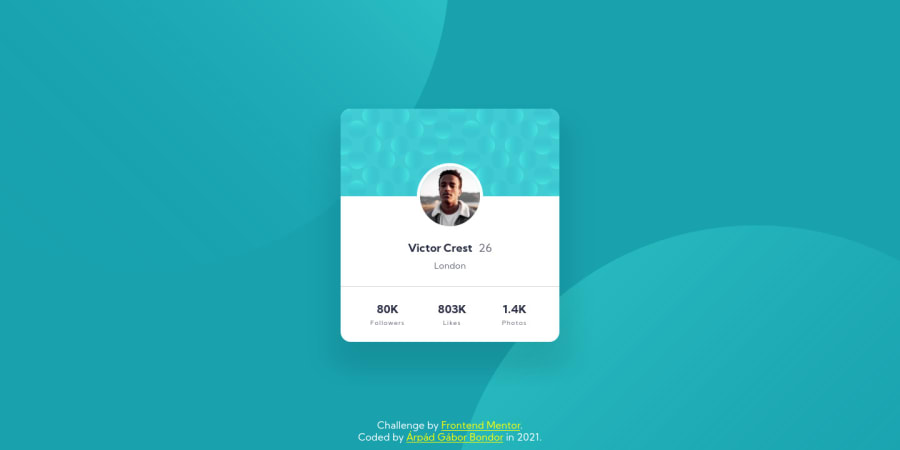

# Frontend Mentor - Profile card component solution

This is a solution to the [Profile card component challenge on Frontend Mentor](https://www.frontendmentor.io/challenges/profile-card-component-cfArpWshJ). Frontend Mentor challenges help you improve your coding skills by building realistic projects.

## The challenge

Your challenge is to build out this profile card component and get it looking as close to the design as possible.

You can use any tools you like to help you complete the challenge. So if you've got something you'd like to practice, feel free to give it a go.

## Screenshot

## Links

-   Solution URL: [Frontend Mentor solution](https://www.frontendmentor.io/solutions/mobile-first-pure-html-css-IWadjyCsM)
-   Live Site URL: [Deployed on Github Pages](https://arpadgbondor.github.io/Web_challenge_6-Frontend_Mentor-Profile_card_component/)

## Built with

-   HTML5
-   CSS3
-   Mobile-first workflow

## Author

-   Github - [Arpad G. Bondor](https://github.com/ArpadGBondor)
-   Frontend Mentor - [Arpad G. Bondor](https://www.frontendmentor.io/profile/ArpadGBondor)
